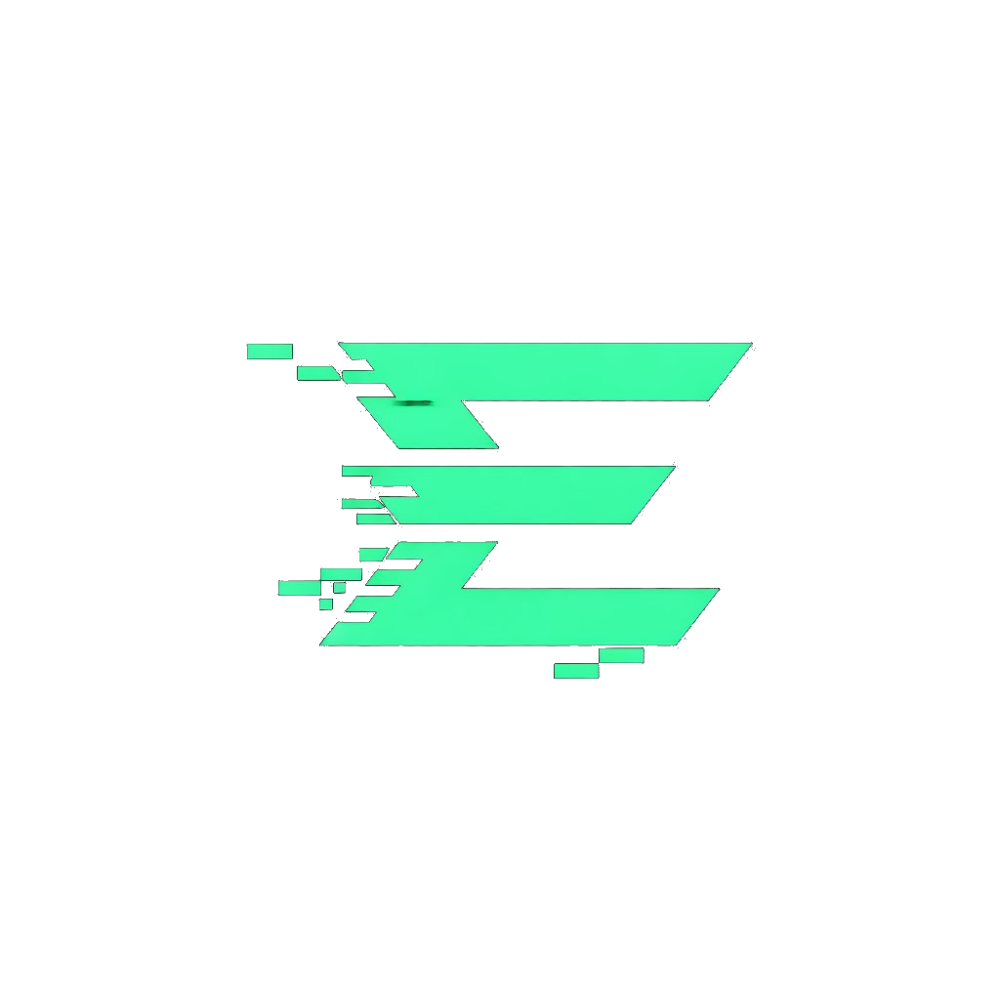
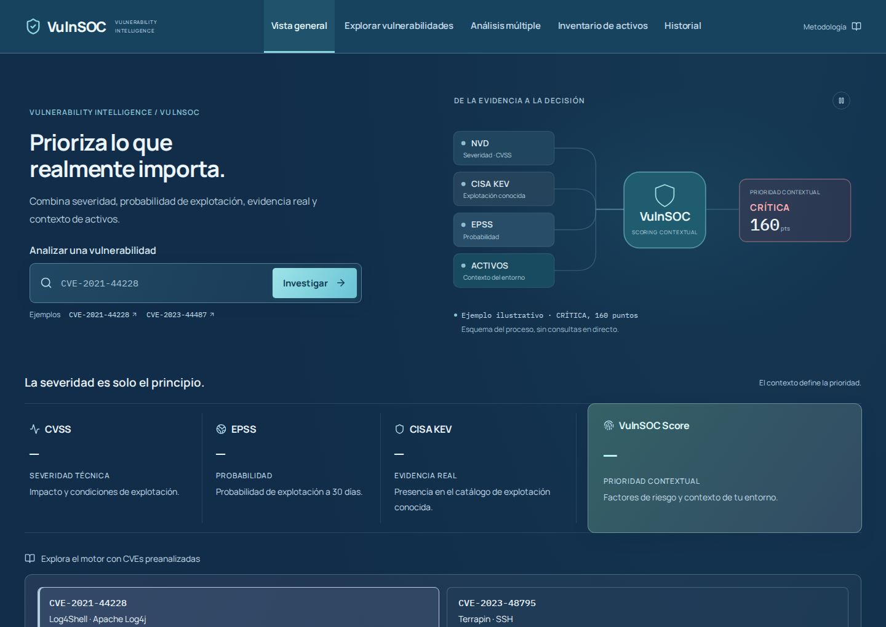
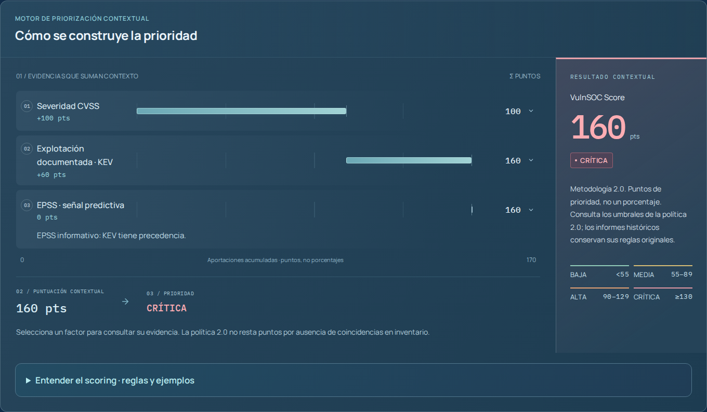
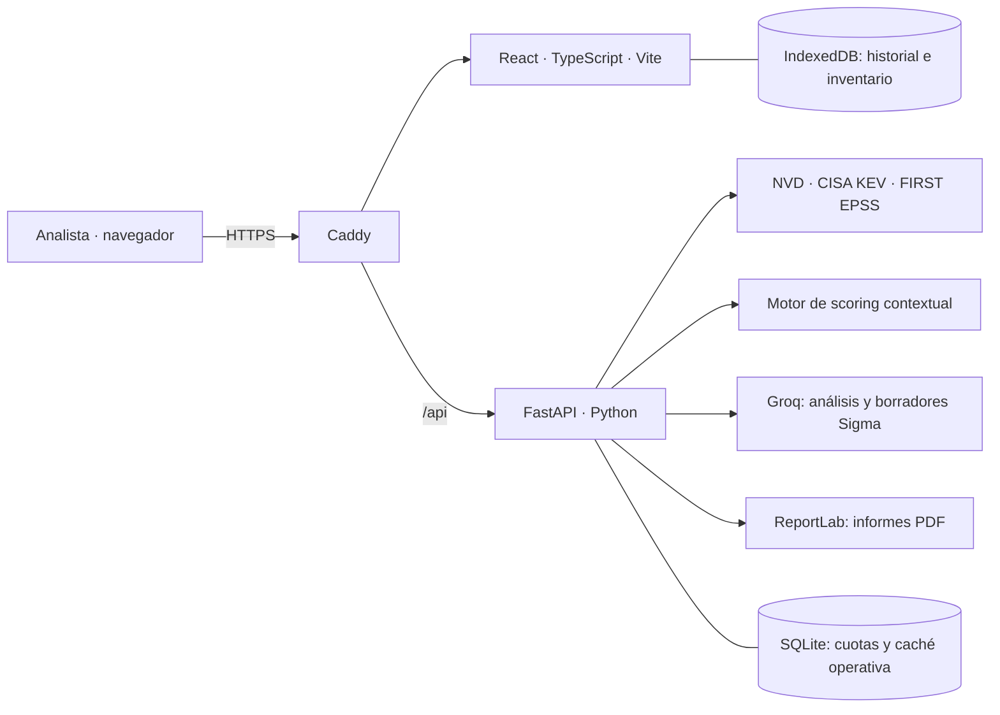

<div align="center">



# VulnSOC Assistant

### La severidad es solo el principio. El contexto define la prioridad.

**Vulnerability Intelligence · Scoring explicable · Análisis asistido por IA**

[](https://vulnsoc.iamescri.es)
[](frontend/package.json)
[](frontend/src)
[](backend)
[](compose.yaml)
[](LICENSE)

[Abrir la herramienta](https://vulnsoc.iamescri.es) · [Qué puedes hacer](#qué-puedes-hacer) · [Motor de scoring](#motor-de-scoring) · [Instalación](#ejecutar-en-local) · [Despliegue](deploy/README.md)

</div>

---

## De una CVE a una decisión fundamentada

**VulnSOC Assistant** es una herramienta de análisis y priorización de vulnerabilidades creada por **[iamEscri](https://github.com/iamEscri)**. Nació como Trabajo Fin de Máster en Ciberseguridad y evolucionó hacia una aplicación web independiente, con frontend React, API FastAPI y despliegue en un VPS con Docker y HTTPS automático.

Reúne **NVD, CISA KEV y FIRST EPSS**, incorpora el contexto declarado de tus activos y explica cómo cada factor contribuye a la prioridad. Desde la misma interfaz puedes investigar una vulnerabilidad, comparar un lote, revisar evidencias y generar un informe para compartir.

> **La IA ayuda a interpretar. El motor de scoring calcula.** La puntuación se obtiene mediante reglas explícitas y reproducibles a partir de los datos disponibles; no la decide un modelo de lenguaje.

[](https://vulnsoc.iamescri.es)

*Interfaz real de la versión web. La portada incluye ejemplos didácticos separados del historial; las capturas no representan datos en directo.*

## Qué puedes hacer

| Área | Funcionalidad |
|---|---|
| **Vista general** | Investigar una CVE y entender el flujo de fuentes, scoring y prioridad. |
| **Explorar vulnerabilidades** | Buscar por descripción o seleccionar un producto y su versión mediante CPE. |
| **Análisis múltiple** | Consultar hasta 20 CVEs distintos por lote y comparar sus resultados. |
| **Inventario de activos** | Registrar tecnologías, versiones, criticidad y exposición para contextualizar la prioridad. |
| **Historial** | Conservar análisis en el navegador, importar/exportar JSON y actualizar resultados anteriores. |
| **Detalle de CVE** | Revisar CVSS, EPSS, KEV, factores del score, referencias y activos relacionados. |
| **Análisis con IA** | Generar resumen ejecutivo, análisis técnico y mitigación, con títulos, listas, tablas y código formateados. |
| **Detección Sigma** | Consultar reglas o generar un borrador y descargarlo en YAML para su revisión. |
| **Informe PDF** | Exportar el resultado y el análisis disponible sin exigir una generación de IA. |
| **Metodología** | Consultar reglas, umbrales, ejemplos paso a paso y limitaciones desde la propia aplicación. |

La interfaz mantiene navegación superior, colores semánticos y adaptación a móvil, con soporte para movimiento reducido.

## Motor de scoring

El motor contextual es la aportación central de VulnSOC. Utiliza **una única puntuación en puntos**, acompañada de su prioridad y del desglose de evidencias.

| Señal | Qué aporta | Política 2.0 |
|---|---|---|
| **CVSS** | Severidad técnica | CVSS × 10, redondeado a entero. |
| **CISA KEV** | Explotación documentada | +60. Garantiza un mínimo de 90 puntos antes del ajuste por activos. |
| **EPSS** | Probabilidad estimada de explotación a 30 días | Sin KEV confirmado: +0 si <1 %; +10 desde 1 %; +20 desde 10 %; +30 desde 70 %. Se aplica un solo tramo. |
| **Activo compatible** | Contexto del entorno | +5 por producto y versión compatibles; criticidad baja +0, media +5 o alta +15; exposición declarada a Internet +15. |

**KEV tiene precedencia sobre EPSS:** cuando existe inclusión confirmada en KEV, EPSS sigue visible, pero no añade otra bonificación. Del inventario se utiliza un único activo, el de mayor contribución conjunta, hasta +35 puntos.

| Baja | Media | Alta | Crítica |
|:---:|:---:|:---:|:---:|
| **0–54** | **55–89** | **90–129** | **≥130** |

### Un ejemplo que se puede seguir punto a punto

Escenario didáctico de Log4Shell, sin ajuste por inventario:

```text
CVSS 10 × 10                       +100
Explotación documentada en KEV       +60
EPSS: informativo por precedencia     +0
                                   ────
VulnSOC Score                       160 puntos · CRÍTICA
```



### Decisiones que hacen interpretable el resultado

- **Dato desconocido ≠ cero.** Sin CVSS utilizable ni KEV confirmado, la prioridad queda «Sin determinar».
- **Sin coincidencias ≠ entorno seguro.** No encontrar compatibilidad de inventario no resta puntos.
- **Compatibilidad ≠ compromiso.** Producto y versión compatibles requieren revisar también la configuración.
- **Severidad ≠ prioridad contextual.** CWE, vector y antigüedad se muestran como evidencias, sin bonificaciones adicionales.
- **Misma metodología para comparar.** Los informes históricos conservan su versión y resultado originales.

Los pesos son una **política heurística propia**, no un estándar oficial ni una probabilidad de riesgo calibrada. Con las reglas actuales pueden alcanzarse 195 puntos; la prioridad crítica comienza en 130. Las pruebas verifican coherencia, no eficacia predictiva en todos los entornos.

**[Leer la metodología completa →](docs-methodology.md)**

## Arquitectura



| Capa | Tecnologías y función |
|---|---|
| **Interfaz** | React 19, TypeScript, Vite, Lucide y Markdown con soporte de tablas. |
| **API y evidencias** | FastAPI, Pydantic y cliente compartido para consultar fuentes con caché y espaciado de solicitudes. |
| **Priorización** | Motor Python independiente de la IA, con factores, advertencias y versión de metodología. |
| **Persistencia** | IndexedDB en el navegador; SQLite en el servidor para caché y cuotas operativas. |
| **Publicación** | Docker Compose y Caddy: archivos estáticos, proxy hacia la API y HTTPS automático. |
| **Verificación** | unittest, Vitest y Playwright; prueba opcional con servicios reales. |

## Ejecutar en local

Instrucciones para **Linux/macOS**, con **Python 3.12**, **Node.js 22** y Git instalados.

```bash
git clone https://github.com/iamEscri/vulnsoc-assistant.git
cd vulnsoc-assistant

python3 -m venv .venv
.venv/bin/pip install -r backend/requirements.lock
npm ci --prefix frontend
```

Para utilizar IA, crea un archivo `.env` en la raíz y configura tu clave directamente en él:

```dotenv
IA_PROVIDER=groq
GROQ_API_KEY=tu_clave_de_groq
GROQ_MODEL=openai/gpt-oss-120b
AI_DAILY_LIMIT=80
AI_VISITOR_DAILY_LIMIT=10
NVD_API_KEY=
GITHUB_TOKEN=
```

`NVD_API_KEY` y `GITHUB_TOKEN` son opcionales. La búsqueda de reglas Sigma en GitHub puede requerir token; la alternativa generada requiere IA. Las consultas a fuentes y la exportación PDF pueden utilizarse sin una clave de IA. El archivo `.env` está excluido de Git y de las imágenes Docker.

```bash
python3 scripts/dev.py
```

- **Web:** http://127.0.0.1:5173
- **Documentación de API:** http://127.0.0.1:8010/api/docs
- **Detener ambos servicios:** `Ctrl+C` en esa terminal.

## Desplegar con Docker

Con Docker Engine y Compose instalados, añade `DOMAIN=tu-subdominio.example` al `.env`, apunta el DNS al servidor y deja disponibles TCP 80 y 443:

```bash
docker compose up -d --build
docker compose ps
```

Caddy gestiona el certificado y la redirección a HTTPS. La API permanece en la red interna de Docker. Los volúmenes conservan certificados y estado operativo entre reinicios.

**[Guía de despliegue, configuración y mantenimiento →](deploy/README.md)**

## Verificación

Compilación y pruebas de datos, API y scoring:

```bash
npm run build --prefix frontend
npm test --prefix frontend
.venv/bin/python -m unittest discover -s tests -v
```

Para las pruebas de navegador, instala Chromium y mantén la web local arrancada en otra terminal:

```bash
npx --prefix frontend playwright install chromium
npx --prefix frontend playwright test --config frontend/playwright.config.ts
```

Las pruebas habituales usan respuestas controladas para comprobar también errores, fuentes ausentes e importaciones históricas. La prueba externa se omite por defecto. Para ejecutarla con API, conectividad y clave de IA configuradas:

```bash
VULNSOC_LIVE=1 npx --prefix frontend playwright test --config frontend/playwright.config.ts live.spec.ts
```

Esta última consume cuota y comprueba análisis, IA, Sigma y descarga de PDF. No valida por sí sola las recomendaciones generadas ni la eficacia de una regla de detección.

## Datos y alcance

**Historial e inventario viven en tu navegador.** No hay cuentas ni sincronización entre dispositivos. Exporta JSON antes de borrar datos del sitio o cambiar de dominio: `localhost` y la web pública tienen almacenamientos separados.

El inventario se envía al backend al contextualizar un análisis. Si solicitas IA, el contexto del informe se procesa mediante el proveedor configurado. Las claves de API permanecen en el servidor.

Las fuentes pueden cambiar, estar incompletas o devolver datos en caché. La IA puede equivocarse y las reglas Sigma requieren adaptación y pruebas. VulnSOC no realiza escaneos ni acredita que un activo esté comprometido; las decisiones de remediación requieren contrastar evidencias y avisos del proveedor.

## Del TFM a una herramienta publicada

El proyecto conserva su implementación original en Streamlit (`app.py`) como referencia de su evolución. La versión web mantenida utiliza React y FastAPI, incorpora una metodología de scoring documentada y se publica en un VPS con Docker y Caddy.

Desarrollado por **[iamEscri](https://github.com/iamEscri)** como proyecto personal de ingeniería aplicada a ciberseguridad.

¿Has encontrado un fallo o tienes una propuesta? [Abre una incidencia](https://github.com/iamEscri/vulnsoc-assistant/issues) con los pasos para reproducirlo, sin incluir claves ni información sensible de tus activos.

## Fuentes y licencia

[NVD](https://nvd.nist.gov/) · [CISA KEV](https://www.cisa.gov/known-exploited-vulnerabilities-catalog) · [FIRST EPSS](https://www.first.org/epss/) · [SigmaHQ](https://github.com/SigmaHQ/sigma)

Proyecto independiente: estas organizaciones no avalan los pesos de VulnSOC. El código se distribuye bajo licencia **[MIT](LICENSE)**; las fuentes y reglas externas conservan sus propias condiciones.
